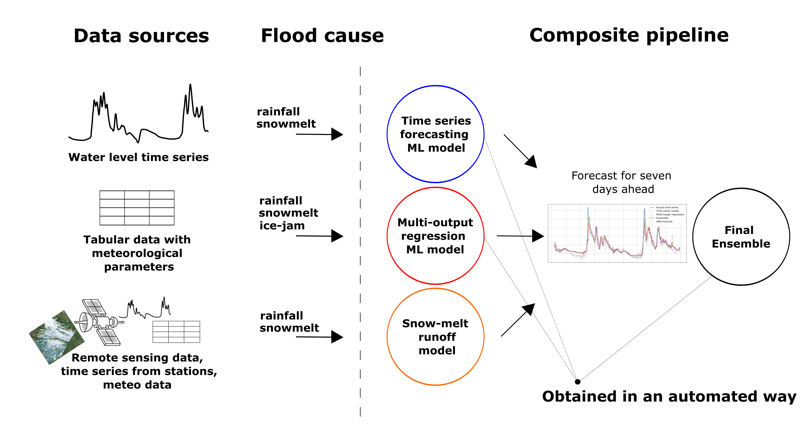

# composite-flood-forecast

Code for paper "Short-term River Flood Forecasting using Composite Models and Automated Machine Learning: the Case Study of Lena River"

## Abstract 
The paper presents an automated hybrid approach for short-term river flood forecasting. It is based on multi-modal data 
fusion from different sources (weather stations, water height sensors, remote sensing data). 
To improve the forecasting efficiency, the machine learning methods and the Snowmelt-Runoff physical model are combined 
in a composite modeling pipeline using automated machine learning techniques.